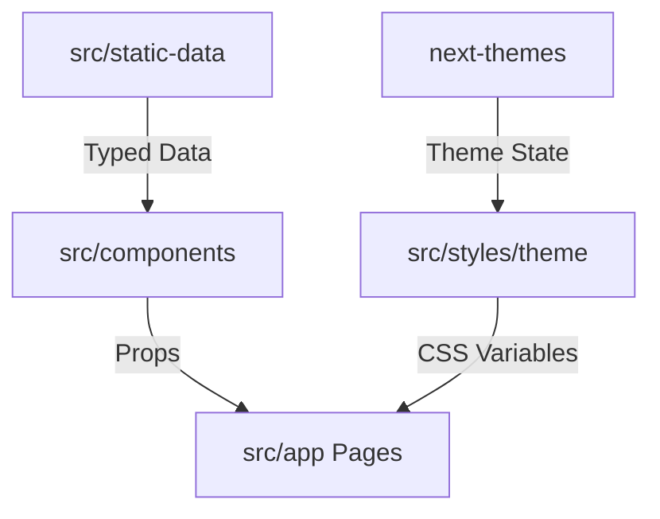

# Atheer Portfolio 🚀

[](https://nextjs.org/)
[](https://tailwindcss.com/)
[](https://www.typescriptlang.org/)
[](https://www.framer.com/motion/)
[](https://ui.shadcn.com/)

**Atheer** is a premium, cinematic portfolio platform built with Next.js. It's designed to showcase developer talent with a high-end "Glow & Glass" aesthetic, inspired by modern design standards like those of Brittany Chiang.

---

## ⚡ Quick Start

```bash
git clone https://github.com/your-username/atheer.git && cd atheer && npm install && npm run dev
```

---

## ✨ Features

- **Cinematic UI**: Smooth entry animations using Framer Motion and a signature "Spotlight" mouse-tracking effect.
- **Dynamic Theming**: Multiple color themes (Teal, Ruby, Emerald, etc.) that persist across sessions.
- **Glassmorphic Design**: Modern, semi-transparent surfaces with consistent visual depth.
- **Data-Driven Architecture**: Content is separated from logic using typed static-data files.
- **Performance Optimized**: Tree-shakeable icons, optimized fonts, and minimal client-side weight.

---

## 📸 Visuals


*(Replace this with your actual high-quality portfolio screenshot!)*

> [!TIP]
> Senior readers look for interactivity. Include a GIF of the "Spotlight" effect tracking your cursor.

---

## 🏗️ Architecture at a Glance

Atheer follows a **Data-to-UI** separation pattern, making it extremely easy to maintain or port to a headless CMS later.



---

## 🛠️ Installation & Setup

### Requirements
- **Node.js**: 18.x or higher
- **npm** or **yarn**

### Detailed Steps
1. **Clone & Enter**:
   ```bash
   git clone https://github.com/your-username/atheer.git
   cd atheer
   ```
2. **Install**:
   ```bash
   npm install
   ```
3. **Run Dev**:
   ```bash
   npm run dev
   ```

---

## 📖 Usage & Customization

### 1. Edit Your Content
All content is located in `src/static-data/`:
- `bio.ts`: Your personal summary.
- `experiences.ts`: Professional history.
- `projects.ts`: Your featured work.

### 2. Available Commands
| Command | Result |
| :--- | :--- |
| `npm run dev` | Starts development server at `localhost:3000` |
| `npm run build` | Optimizes and builds for production |
| `npm run lint` | Checks for code quality and stylistic errors |

---

## 🗺️ Roadmap & Vision

We are currently in **Phase 2**.

- [x] **Phase 1**: Core Architecture & Theming.
- [/] **Phase 2**: Interactive Motion & Micro-interactions.
- [ ] **Phase 3**: Visual Depth & UI Refinement (Bento Grids).
- [ ] **Phase 4**: Performance & SEO Optimization.

See the full [ROADMAP](./docs/ROADMAP.md) for details.

---

## 🤝 Contributing

We welcome contributions! To get started:
1. Fork the project.
2. Read our **[Contributing Guide](./CONTRIBUTING.md)** for detailed standards and workflows.
3. Create your feature branch (`git checkout -b feature/AmazingFeature`).
4. Commit your changes (`git commit -m 'Add some AmazingFeature'`).
5. Push to the branch (`git push origin feature/AmazingFeature`).
6. Open a Pull Request.

---

## 📁 Technical Deep-Dives

- 🏗️ [Architecture Guide](./docs/ARCHITECTURE.md)
- 🎨 [Theme System & Guidelines](./docs/THEME_SYSTEM.md)
- 📋 [Feature Specifications](./docs/FEATURES.md)
- 🏁 [Project Roadmap](./docs/ROADMAP.md)

---

## ⚖️ License & Acknowledgment

- **License**: MIT
- **Inspiration**: Brittany Chiang
- **Built with**: Next.js 15, Tailwind CSS, Framer Motion.
