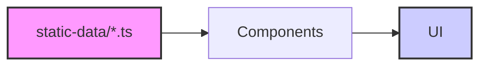

# Architecture Design: Atheer Portfolio

A lightweight, scalable structure optimized for performance and developer experience.

---

## 🛠️ Technology Stack

| Layer | Technology | Why |
|:---|:---|:---|
| Framework | Next.js (App Router) | File-based routing, server components, SEO |
| Language | TypeScript | Type safety, better autocomplete, fewer bugs |
| Styling | Tailwind CSS | Utility-first, responsive, fast to prototype |
| Theming | next-themes | Light/dark/multi-theme support |
| Icons | react-icons | Large icon library, tree-shakeable |

---

## 🏗️ Directory Structure

- **`/src/app`**: Next.js App Router (Pages & Layouts).
- **`/src/components`**:
  - `ui/`: **Base UI Components** added via `shadcn/ui` (managed by CLI).
  - `shared/`: Atomic, reusable UI elements built internally.
  - `image/`: Specialized visual components with hover logic.
  - `[page_name]/`: Feature-specific components.
- **`/src/types`**: Centralized TypeScript interfaces for global data consistency.
- **`/src/static-data`**: Version-controlled content (JSON/TS) to keep components clean.
- **`/src/styles`**: Component-scoped CSS using Tailwind `@apply` for clean JSX.

---

## 🔄 Data Lifecycle



1. **Definitions**: Core data shapes are defined in `/src/types`.
2. **Storage**: Content is managed in `/src/static-data` as typed TypeScript objects.
3. **Rendering**: Components import raw data and map them into specialized sub-components (e.g., `ProjectCard`).

---

## 📦 External Libraries

### [Lucide React](https://lucide.dev/) (Icons)
- **Why**: Performance-first, tree-shakeable, and visually consistent with premium designs.
- **Usage**: `import { ArrowUpRight } from 'lucide-react';`

### [React Icons](https://react-icons.github.io/react-icons/) (Brand Icons)
- **Why**: Handles **official brand logos** that are being deprecated in Lucide (e.g., Instagram, X/Twitter).
- **Usage**: Optimized imports from collections (e.g., `si` for SimpleIcons).

### [shadcn/ui](https://ui.shadcn.com/) (UI Components)
- **Why**: Low-level accessibility (Radix UI) combined with full styling control. 
- **Storage**: Components reside in **`/src/components/ui`**.

---

## 🎨 Styling Strategy

All visual decisions, including our **Theme Choice**, **Tailwind Integration**, and **CSS Conventions**, are documented in:
- **[Style & Theme Guidelines](./styling/GUIDELINES.md)**
- **[Theme System](./THEME_SYSTEM.md)**

---

## 📐 Page Layout

### Desktop vs Mobile
- On **desktop**: The left sidebar stays fixed (sticky), only the right column scrolls.
- On **mobile**: The layout stacks vertically, and the entire page scrolls.

```
Desktop (≥ 1024px)              Mobile (< 1024px)
┌──────────┬──────────────┐     ┌──────────────────┐
│ Sidebar  │  Content     │     │     Header       │
│ (sticky) │  (scrolls)   │     │     Sidebar      │
│          │              │     │     Content      │
└──────────┴──────────────┘     └──────────────────┘
```
